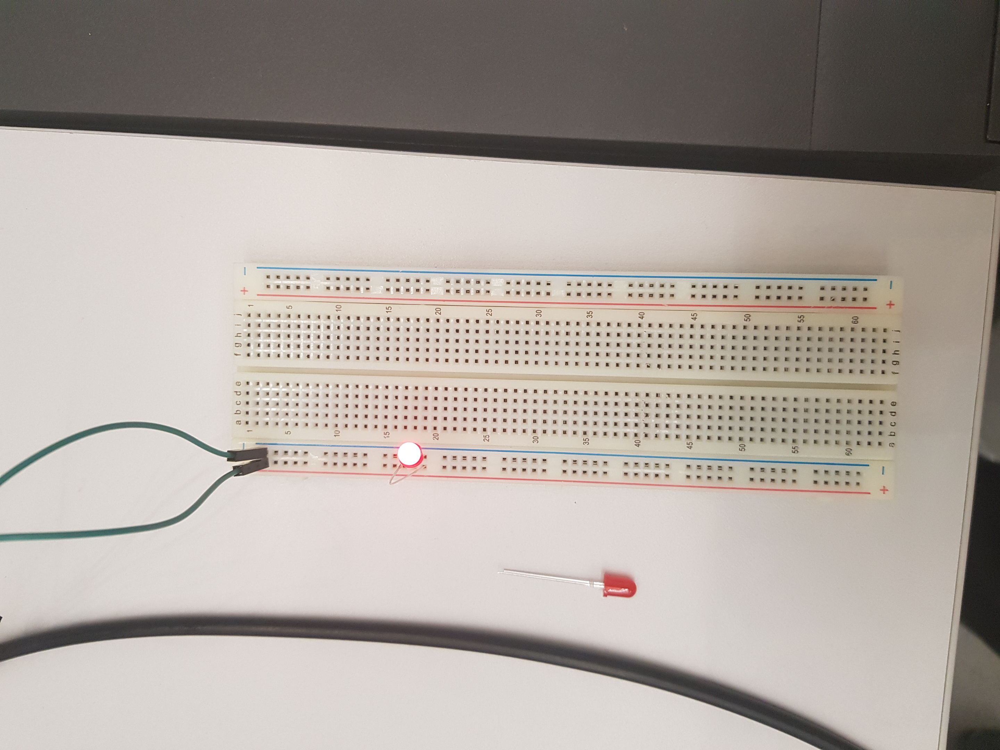

# dig333-devlog

#### Weeks: [1](#week-1) [2](#week-2) [3](#week-3) [4](#week-4) [5](#week-5) [6](#week-6) [7](#week-7) [8](#week-8) [9](#week-9) [10](#week-10) [11](#week-11) [12](#week-12) [13](#week-13) [14](#week-14) [15](#week-15)

<!--
BELOW IS A WEEKLY TEMPLATE. COPY/PASTE IT TO ADD A WEEK. SEE ASSIGNMENTS FOR DETAILS 
https://docs.google.com/document/d/1PAoPz-3vDPFWS5q9RHRb-dC7T4earpFXJW8w6v9wfZ0/edit
-->

## Week 1

### Context

 

"The Internet of Things has a dirty little secret: it's not really yours" by Internet of Shit

- The Internet of Shit's article on The Verge criticizes house gadgets that heavily rely on WiFi. The author emphasizes their need for Internet as a major downside in comparison to old "analog" products. Similarly, the author points out that the Internet's fast paced trend cycle is not compatible with physical house gadgets, that need to (or should) last for longer. Finally, the author criticizes the amount of control that manufacturers have over buyers, as their houses now rely on the company's software and support. Simultaneously, these companies are able to collect valuable data, further increasing their support.
- "What we really need from those building the Internet of Things is commitment" &rarr; companies must commit to not abuse the power of having their softawre in consumer's homes
- I think there is a blurry lines in IoTs. Do phones count? If so, there does not seem to be an "unplugged" alternative, as there are with thermostats and lightbulbs. With this in mind, it seems almost impossible to fully avoid IoT.
- Can the Internet of Things be sustainable (for consumers) in the long term? Are the benefits of IOT over "regular" gadgets worth it?

 

"The Internet of Things: Roadmap to a Connected World" by Sanjay Sarma

- Sarma's article provides, in some sense, a response to Internet of Shit's concerns. Although there is no comment from the manufacturers, Sarma provides clear steps that he believes are viable alternatives for long term success and sustainability of IoT. Most notably, Sarma is concerned with potential security threats of having consumer's houses entirely connected to the internet, each product with its own (potentially incompatible) security protocols.
- "No question about it: The IoT will influence everything from robots and retail to buildings and banking" &rarr; In response to my question above, Sarma seems to believe there isn't (or won't be) aspects of life not affected by IoT. 
- Although Sarma's roadmap is reasonable in the sense that it provides a solid alternative to most security concerns with IoT, I think it is impractical, as it requires manufacturers to collaborate with each other even though they are mostly each other's competition.
- Is Sarma's roadmap viable?

### Experiments
<!-- List each Platt experiment / Monk recipe outcome, adding notes, photos, schematics, captions to show your work. -->

Experiments for the week delayed. See DevLog Wk. 2
#
## Week 2

### Context

 

Article
- Summarize the article(s) in 3-4 sentences. Also include...
- 1 quote from the reading(s)
- 1 related comment on the reading(s)
- 1 related follow-up question (what question does it bring up for you?)

 

Platt
- Summarize the article(s) in 3-4 sentences. Also include...
- 1 quote from the reading(s)
- 1 related comment on the reading(s)
- 1 related follow-up question (what question does it bring up for you?)
  
 

Monk
- Summarize the article(s) in 3-4 sentences. Also include... 
- 1 quote from the reading(s)
- 1 related comment on the reading(s)
- 1 related follow-up question (what question does it bring up for you?

 

### Experiments
<!-- List each Platt experiment / Monk recipe outcome, adding notes, photos, schematics, captions to show your work. -->

1. Your First Circuit
  

       *  Instead of shorting a battery, we burnt an LED by increasing the voltage beyond its limit.
  
       *  We increased the limit by chaining batteries together in parallel as opposed to in series.
   
    + I learned that connecting multiple batteries to a breadboard does not increase the voltage, but that instead they should be connected in parallel. 
    + How is voltage affected by chaining batteries together?

 

1. Let’s Abuse a Battery!
    1. 
       - Instead of shorting a battery, we burnt an LED by increasing the voltage beyond its limit.
       - We increased the limit by chaining batteries together in parallel as opposed to in series.
    2. I learned that connecting multiple batteries to a breadboard does not increase the voltage, but that instead they should be connected in parallel. 
    3. How is voltage affected by chaining batteries together?

