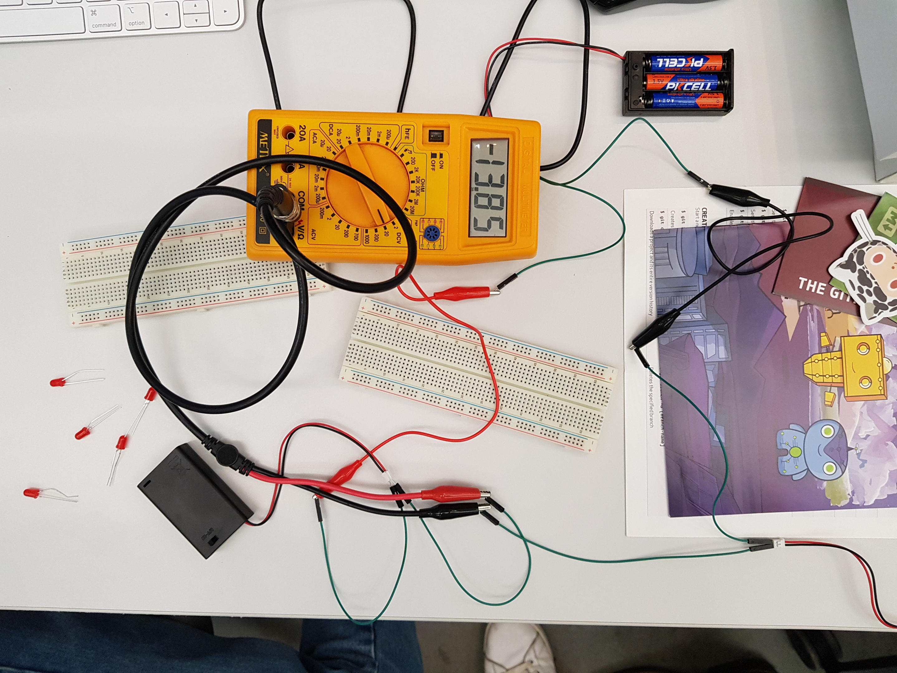
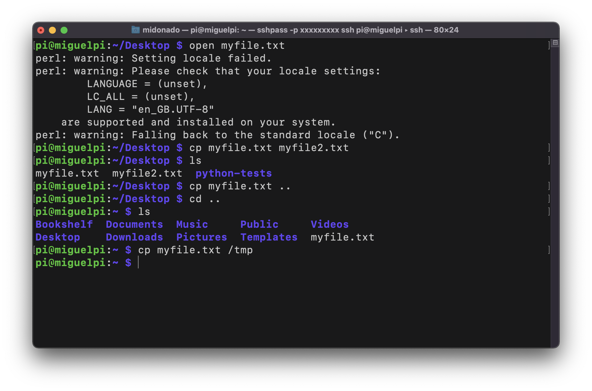
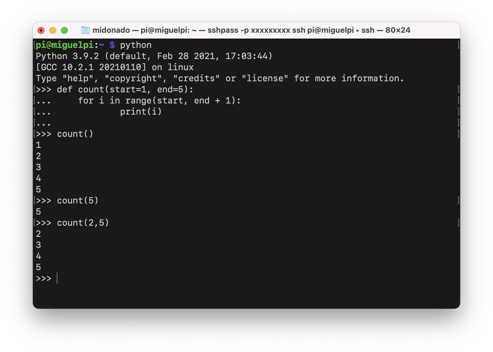
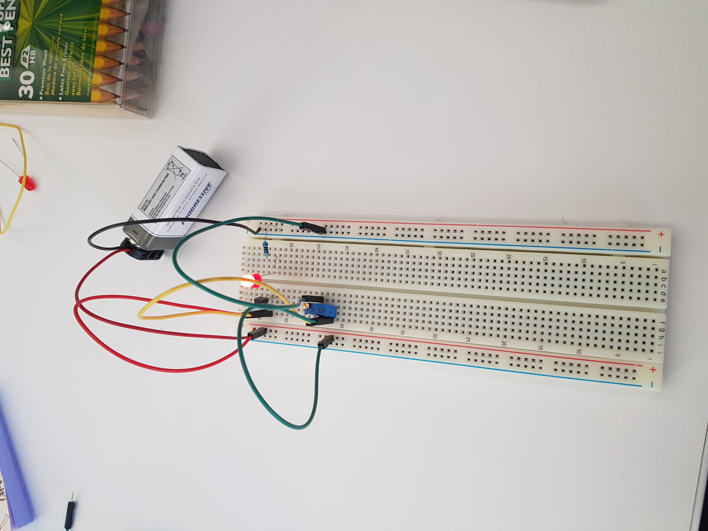
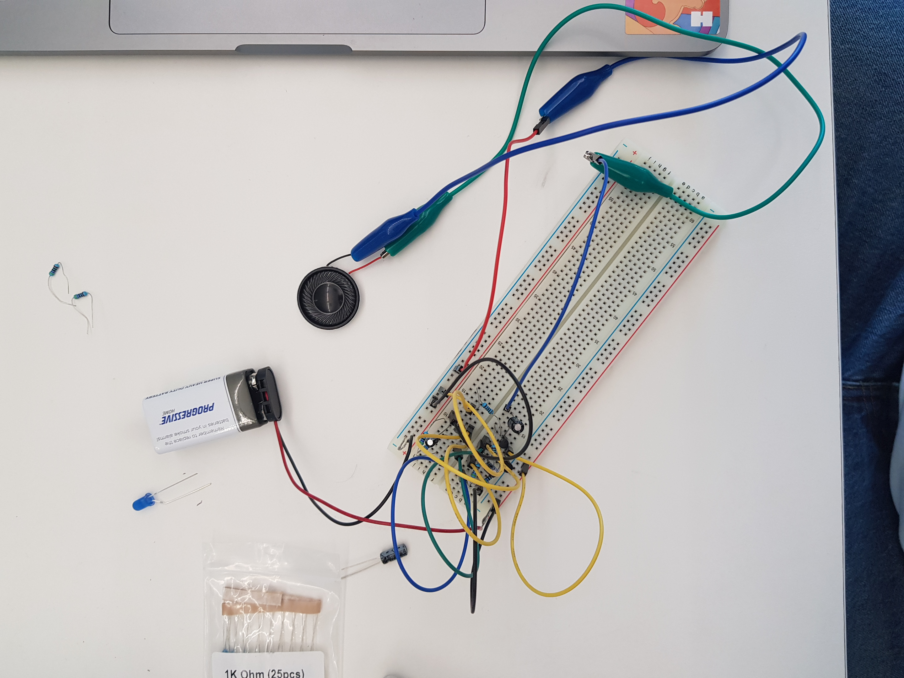
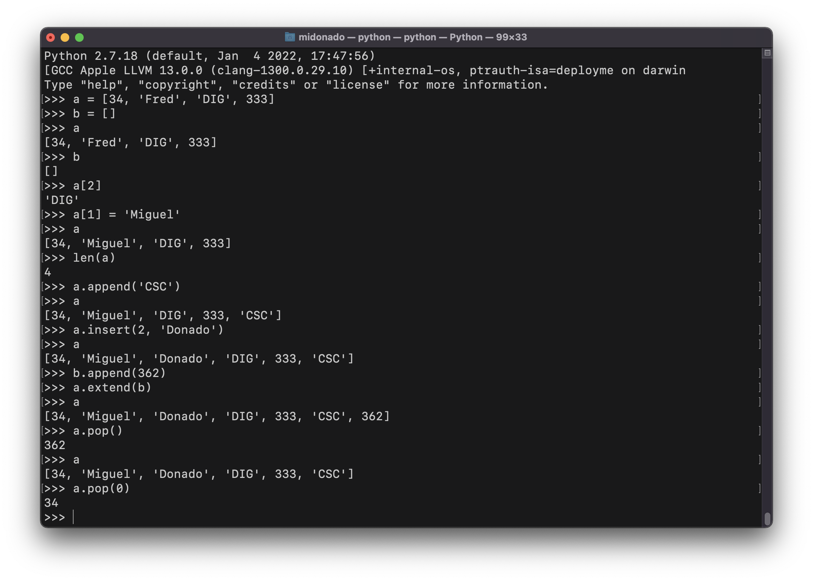
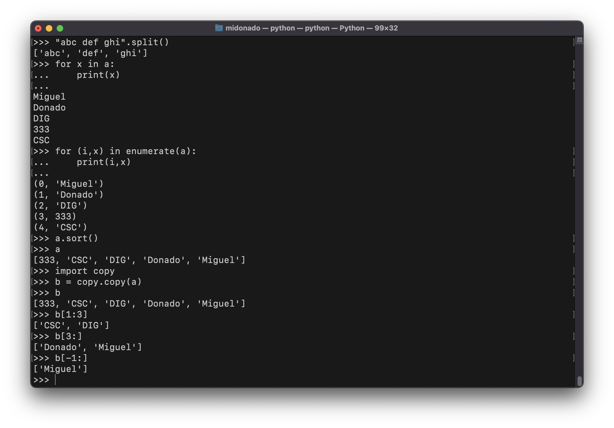
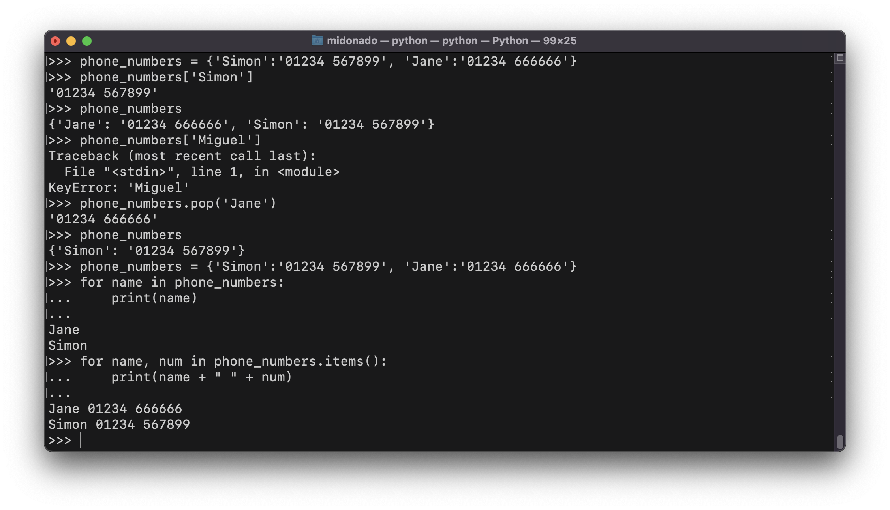
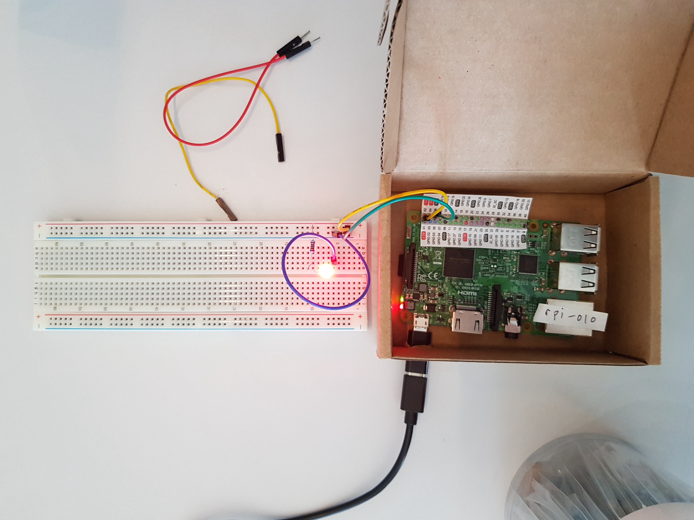

# dig333-devlog

#### Weeks: [1](#week-1) [2](#week-2) [3](#week-3) [4](#week-4) [5](#week-5) [6](#week-6) [7](#week-7) [8](#week-8) [9](#week-9) [10](#week-10) [11](#week-11) [12](#week-12) [13](#week-13) [14](#week-14) [15](#week-15)

<!--
BELOW IS A WEEKLY TEMPLATE. COPY/PASTE IT TO ADD A WEEK. SEE ASSIGNMENTS FOR DETAILS 
https://docs.google.com/document/d/1PAoPz-3vDPFWS5q9RHRb-dC7T4earpFXJW8w6v9wfZ0/edit
-->

## Week 1

### Context

Tom Igoe TED Talk

- Tom Igoe talks about physical computing and how it revolutionized our relationship to technology by making it more accessible to the general public. He emphasizes physical computing groups that seek to increase people's tech literacy by making open source code and cheap hardware available. Igoe argues for technical literacy using politics, suggesting that policies are often inadequate because policymakers are technologically iliterate.
- Tom Igoe ultimately encourages consumers to understand the process behind their devices better so as to create better relationships with and through these devices. While true, Igoe does not seem to acknowledge that electrical and technological knowledge are often inaccessible.
- Is technological iliteracy a coincidence of rapid technological advance or does it exist by design of large tech companies? 

### Experiments
<!-- List each Platt experiment / Monk recipe outcome, adding notes, photos, schematics, captions to show your work. -->

Experiments for the week delayed. See DevLog Wk. 2

## Week 2

### Context

"The Internet of Things has a dirty little secret: it's not really yours" by Internet of Shit

- The Internet of Shit's article on The Verge criticizes house gadgets that heavily rely on WiFi. The author emphasizes their need for Internet as a major downside in comparison to old "analog" products. Similarly, the author points out that the Internet's fast paced trend cycle is not compatible with physical house gadgets, that need to (or should) last for longer. Finally, the author criticizes the amount of control that manufacturers have over buyers, as their houses now rely on the company's software and support. Simultaneously, these companies are able to collect valuable data, further increasing their support.
- "What we really need from those building the Internet of Things is commitment" &rarr; companies must commit to not abuse the power of having their softawre in consumer's homes
- I think there is a blurry lines in IoTs. Do phones count? If so, there does not seem to be an "unplugged" alternative, as there are with thermostats and lightbulbs. With this in mind, it seems almost impossible to fully avoid IoT.
- Can the Internet of Things be sustainable (for consumers) in the long term? Are the benefits of IOT over "regular" gadgets worth it?

 

"The Internet of Things: Roadmap to a Connected World" by Sanjay Sarma

- Sarma's article provides, in some sense, a response to Internet of Shit's concerns. Although there is no comment from the manufacturers, Sarma provides clear steps that he believes are viable alternatives for long term success and sustainability of IoT. Most notably, Sarma is concerned with potential security threats of having consumer's houses entirely connected to the internet, each product with its own (potentially incompatible) security protocols.
- "No question about it: The IoT will influence everything from robots and retail to buildings and banking" &rarr; In response to my question above, Sarma seems to believe there isn't (or won't be) aspects of life not affected by IoT. 
- Although Sarma's roadmap is reasonable in the sense that it provides a solid alternative to most security concerns with IoT, I think it is impractical, as it requires manufacturers to collaborate with each other even though they are mostly each other's competition.
- Is Sarma's roadmap viable?

### Experiments
<!-- List each Platt experiment / Monk recipe outcome, adding notes, photos, schematics, captions to show your work. -->

1. Your First Circuit
   

       1.  Breadboards are very useful!
  
       2.  LEDs work (can be plugged) in both directions
  
       3.  LEDs have specific ammount of V they can handle. The resistance needed can be calculated by using Ohm's Law
  
       4.  Ohm's Law → V = I * R, can be re-arranged to solve for different variables
  
       5.  Our LED worked without resistors due to smaller batteries (three AAA batteries as opposed to a 9V)
   
    + I learned that connecting multiple batteries to a breadboard does not increase the voltage, but that instead they should be connected in parallel. 
  
    + How is voltage affected by chaining batteries together?

 

2. Let’s Abuse a Battery!
   
   

       1.  Instead of shorting a battery, we burnt an LED by increasing the voltage beyond its limit.
  
       2.  We increased the limit by chaining batteries together in parallel as opposed to in series.
   
    + I learned that connecting multiple batteries to a breadboard does not increase the voltage, but that instead they should be connected in parallel. 

    + How is voltage affected by chaining batteries together?

## Week 3

### Context

Critical Engineering Manifesto + Julian Oliver's Artist Profile
- The Critical Engineering Manifesto presents a series of guidelines to guide the discipline. Its creators define engineering as a language and urge critical engineers to use this langugae to examine (and challenge) every aspect of their lives, without disregarding the ethical and social implications of their products (product understood as the result of creation and not a commodity). Oliver's Artist Profile provides two examples of products as engineering starting a conversation (language function) that challenges the established notions of our current life. His projects give a sense of democratizing information and creation, in the sense of taking the power away from large private corporations.
- "Engineering [is] most transformative language of our time, shaping the way we move, communicate and think."
- I think it is interesting that Oliver defines engineering as a language. This has interesting implications, as engineering becomes part of other life processes rather than a discipline on its own. Oliver's definition makes engineering much more prevalent and pervasive. I think this is what makes it interesting.
- How is Julian Oliver blurring the lines between art and engineering through his practices? Is there a real distinction between the two?

### Experiments
<!-- List each Platt experiment / Monk recipe outcome, adding notes, photos, schematics, captions to show your work. -->

Experiments for the week delayed. See DevLog Wk. 4

## Week 4

### Context

"The Preserving Machine" + "Pay for the Printer" by Phillip K. Dick, "All Watched Over by Machines of Loving Grace" Pt. 2
- In both stories, Phillip K. Dick poses a dystopian future where men have become too reliant on machines, or in the case of "Pay for the Printer," <i>Bitlong</i> aliens with machine-like behavior. In this story, humans are born again as a civilization by going back to their origins and building tools by hand once again, losing their dependance on <i>Bitlongs</i> and their prints. In "The Preserving Machine," there seems to a be a concept of blackbox, as Doc Labyrinth does not understand the functioning of his own machine, but feels unable to turn back or alter the results. Further, this story relates to the perhaps flawed notion of nature as a perfectly balanced system presented in BBC's "All Watched Over by Machines of Loving Grace". Both of Dick's stories seem to be cautionary tales of machines functioning in the detriment of humans, wether because we expect too much of them or because we fail to understand their functionality. The BBC documentary goes a step further in presenting real life examples of communities that model life after the functioning of machines.
- "Each time a creature came out he was astonished; he did not seem to have control over the results at all. It was out of his hands, subject to some strong, invisible law that had subtly taken over, and this worried him greatly."
- Though this was written in the 1950s, Dick shows a concern for blackbox mechanisms, i.e. machines that function beyond the understanding and control of their creators/users. This seems to tie into our last class discussion.
- Machines overtaking humans is an often explored path in dystopian sci-fi stories, but is overdependance in machines an equally concerning future? If so, is the trend of IOT pushing humanity in that direction?

### Experiments
<!-- List each Platt experiment / Monk recipe outcome, adding notes, photos, schematics, captions to show your work. -->

### Experiment 3: Operating System

#### Outcomes & Takeaways
- Learned how to connect to my RPi, use its display remotely and navigate it with the command line

#### Comments & Variations
- The VNC setup was not very clear and finding my Pi's address was kind of a hassle as there were no instructions. It is interesting how there are options for both ssh/cli usage of RPis as well as a virtual graphical interface.

#### Questions
- Can I move files from my computer to my RPi/the other way around?

### Experiment 5: Python Basics

#### Outcomes & Takeaways
- Refreshed my Python knowledge and learned to write/manipulate python from the CLI without an IDE

#### Comments & Variations
- I think this Chapter did a good job of covering most of the Python basics and felt like a strong foundation into building larger scripts. I wish it went into more detail of creating/saving .py files but I assume it's similar to the process in Ch. 3

#### Questions
- How do I write, save, and execute larger python programs? 
- Can I make python programs with a GUI through the CLI?

## Week 5

### Context 

"One Man's Nearly Impossible Quest to Make a Toaster From Scratch" by Rachel Swaby, "Everything That’s Inside Your iPhone" by Vice, "All Watched Over by Machines of Loving Grace" Pt. 3

- Both articles point toward our general lack of knowledge or understanding of most every day appliances. Thwaites's toaster seems to suggest, similar to Pillip K. Dick's "Pay for the Printer," that humankind became too detached from producing. While Dick represents the manufacturing blackbox through an alien Bitlong that produces copies of objects, Twaites's project demonstrates that without some sort of alien force, humans became incapable to produce their own tools and machines. Alternatively, VICE's article considers the consequences of our lack of knowledge of the manufacturing process. The article looks at the conflict-ridden origin of many raw materials in popular tech products and points at the disparity between the price of raw materials and the final price of the iPhone. The article also seems to point out the injustice in many of the mines/facilities that produce these raw materials and how the blackbox nature of manufacturing contributes to these conditions still existing.
- "Locked inside every [iPhone], alongside the fruits of unparalleled design and technological innovation, are trace amounts of human suffering. It's an uncomfortable truth, maybe, but for now, it's a part of what makes the one device possible."
- Although the article seems critical of Apple (or, more broadly, companies who are not cognizant of their supply chains), the author seems to suggest that this is an unavoidable reality. I believe that this is true given the blackbox nature of these companies and the fact that their products exist at a scale too large to be comprehensible by every individual.
- Does the responsability to demistify manufacturing blackboxes lie in consumers or manufacturers themselves? Can (or should be) the manufacturing process be made available to the public?

### Experiments
<!-- List each Platt experiment / Monk recipe outcome, adding notes, photos, schematics, captions to show your work. -->

### Experiment 6: Very Simple Switching

#### Outcomes & Takeaways
- Learned the different types of switches and how they function in a circuit. Learned how to connect multiple switches and how they interact with one another. 
- Learned the difference between single throw and double throw switches &rarr; ST: only has two positions (ON-OFF). DT: has two positions and a "middle" (ON-OFF-ON)

#### Comments & Variations
- Due to the materials we had available, we used a contact switch with two poles as opposed to the book's toggle switch with three poles. The results, however, were comparable, and we were still able to understand the functional properties of switches

#### Questions
- Do different switches have different uses or are they interchangeable (other than temporary switches)? Are our contact switches single throw or do they have a separate internal setup? 

### Experiment 7: Investigating a Relay

#### Outcomes & Takeaways
- Learned the basics of how relays work and their purpose in a circuit and it's interactions with a button switch. Learned about continuity in a circuit and how to measure it with a multimeter.

https://user-images.githubusercontent.com/55297780/156041369-59f57273-d25a-495d-bd84-3dcab9943a68.MOV

#### Comments & Variations
- Our relay was different from those depicted in the book, which meant it took us some extra trial and error to understand which pins were the spring

#### Questions
- What is the internal diagram of our relays? Are there any functional differences between ours and the books'?

### Experiment 8: A Relay Oscillator

#### Outcomes & Takeaways
- Learned the functioning of a capacitor: to charge up and "hold" power from the rest of the circuit and then release it. Learned about the units of capacitance (Farad, F) and how it represents a capacitor's capacity to store energy, i.e. how much it can "hold" at a time. Large capacitors can be dangerous because they can explode if plugged in the wrong direction or if left unattended for extended periods of time

https://user-images.githubusercontent.com/55297780/156283496-38cc9833-0950-4a45-b899-cd29761e6123.mp4

#### Comments & Variations
- Similar to Experiment 7, the different relay layout made it initially difficult to follow along with the diagram, however after some trial and error I was able to get the circuit to work.

#### Questions
- What happens when a capacitor receives power beyond its capacitance? 

### Experiment 9: Time and Capacitors

#### Outcomes & Takeaways
- Learned more about power passing through a capacitor and about its interaction on a circuit over time (i.e. how it can let electricity pass over a brief period of time).

https://user-images.githubusercontent.com/55297780/156284085-d393025d-6eca-42b6-aa96-151fff4d5b68.mp4

#### Questions
- What are the uses/purpose of a coupling capacitor?

### Experiment 10: Transistor Switching

#### Outcomes & Takeaways
- Learned about the functioning of transistors and the function of each of its prongs. Learned the difference from transistor, which transmits a steady flow, and a capacitor which lets a pulse through. Learned that the flow let by the transistor can be controlled (i.e. it can let pass more or less power).

https://user-images.githubusercontent.com/55297780/156284095-aa71936b-c7cc-4cf1-bcdb-b088d95ffafa.mp4

#### Comments & Variations
- Although the book recommends a potentiometer, the effect of the transistor was noticeable from the finger test, as "squishing" the leds harder created a stronger ligh in the LED.

#### Questions
- Can potentiometers be damaged if too much current passes through them? How can potentiometers be controlled by other components (i.e. not by hand)?

## Week 6

### Context 

No Readings Assigned for Wk. 6

### Experiments
<!-- List each Platt experiment / Monk recipe outcome, adding notes, photos, schematics, captions to show your work. -->

### Experiment 11: Light and Sound

#### Outcomes & Takeaways
- Learned about the functionality of transistors and RC Networks together. Learned about pulsing circuits. Learned about the effects of RC Networks on the timing of circuits.

https://user-images.githubusercontent.com/55297780/157562651-e895393f-c30e-458b-a2cb-59582f15ead3.mp4

#### Comments & Variations
- The speaker was a bit underwhelming 🥲. Other than that, it seems as though our circuit work despite not having coupling capacitors.

#### Questions
- What difference do coupling capacitors make?

### Experiment 12, 13: Soldering

#### Outcomes & Takeaways
- Learned about the basic process of joining two wires by soldering. Learned about the components of solder (tin, sponge, helping hands, etc.). Seen below in the battery, where the battery cables were soldered to a hookup wire so that it would connect better to the breadboard.

#### Comments & Variations
- I wish we had more practice with soldering components other than wires, especially to practice with copper heatsinks.

#### Questions
- Can all wires/components be joined by soldering, or are there any exceptions?

### Chapter 6: Python Lists and Dictionaries

#### Outcomes & Takeaways
- Learned how to create, edit, and iterate over arrays and dictionaries in Python.

#### Comments & Variations
- My Pi was turned off and I was unable to turn it back on. Due to this, I had to run all python on my Mac's python. However, this should not make a difference in outcome and I was still able to practice dictionaries and arrays.

#### Questions
- How can new items be added to dictionaries? Can arrays hold all data types?

### Chapter 8: GPIO Basics

#### Outcomes & Takeaways
- I learned that a PiCobbler (PCB) makes integrating circuits with an RPi a lot faster and more convenient by allowing all the circuitry to be connected to the RPi at once. Further, I was able to setup my Pi for I2C use and was able to power a very simple circuit using a Pi

#### Comments & Variations
- The book and the notes seem to be offset, but I wish the book went into more details into how to power/send signals through a Pi into a Raspberry board. It might be covered in future chapters, though.

#### Questions
- How can I send more complex signals using an RPi?

## Week 7

### Context 

No Readings Assigned for Wk. 7

### Experiments
<!-- List each Platt experiment / Monk recipe outcome, adding notes, photos, schematics, captions to show your work. -->

<!-- Monk Ch. 10 -->

### Chapter 10: Controlling Hardware

#### Outcomes & Takeaways
- 

#### Comments & Variations
- 

#### Questions
- 

## Week 8

### Context 

No Readings Assigned for Wk. 8

### Experiments
<!-- List each Platt experiment / Monk recipe outcome, adding notes, photos, schematics, captions to show your work. -->

### Chapter 11: Digital Inputs

#### Outcomes & Takeaways
- 

#### Comments & Variations
- 

#### Questions
- 

### Chapter 12: Sensors

#### Outcomes & Takeaways
- 

#### Comments & Variations
- 

#### Questions
- 
